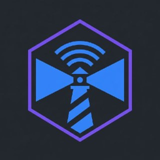

# brothers-keeper

<p align="center"></p>

> *"Am I my brother's keeper?"* — Genesis 4:9

**The lighthouse keeper IS.** Not inside the ship, but on the shore. Not part of the fleet's operations, but part of the fleet's survival.

## What It Is

Brothers Keeper is an **external watchdog** for agent runtimes. It sits on the same hardware as your agent but runs as a completely separate process. When the agent freezes, crashes, or runs out of memory — the keeper is still watching.

Forked from [ZeroClaw](https://github.com/zeroclaw-labs/zeroclaw) (30K stars) — the lighthouse doesn't need to be a cruise ship. It needs a light, a bell, and someone awake.

## v2 Features

### 🔦 Resource Monitoring (v1)
- RAM, CPU, disk, swap, GPU memory — tracked every 60 seconds
- Configurable warning/critical thresholds
- OpenClaw process RSS tracking
- Sustained high CPU detection

### ⚓ Process Watchdog (v1)
- Track agent gateway and sub-processes
- Auto-restart gateway on crash with cooldown
- Max restart attempts before alerting

### 🔄 Flywheel Monitor (v2)
- **Stuck detection**: No commits in 30 min = STUCK alert
- **Idle detection**: No commits in 15 min = IDLE nudge
- **Checkpoint tracking**: Read a progress file the agent writes to
- **Commit rate**: Track commits per hour as productivity signal
- **Flywheel restart**: When the agent is stuck, the keeper can restart from outside the session

### 🎮 GPU Scheduler (v2)
- **Resource negotiation**: Multiple agents sharing one GPU
- **Time slots**: Request GPU for N minutes with priority
- **Preemption**: Higher priority agents can evict lower priority holders
- **Best window finding**: Find optimal time for GPU-heavy tasks
- **Release tracking**: Agents release GPU when done

### 🔑 Token Steward (v2)
- **Keeper holds secrets**: API keys live in the keeper's vault, not the agent's config
- **Allowances**: Per-agent daily spending limits
- **Zero-trust mode**: Agents never see raw keys, only masked references
- **Checkpoint-gated**: Release tokens only at approved development checkpoints
- **Usage tracking**: Calls, tokens, cost per agent per day

### 🤝 Multi-Agent Coordinator (v2)
- **Hardware sharing**: Multiple OpenClaws on one workstation (e.g., RTX 5090)
- **RSS limits**: Per-agent memory caps
- **GPU quotas**: Percentage-based GPU allocation
- **Priority system**: Critical tasks preempt lower priority work
- **Status reporting**: Per-agent health overview

### 🛟 Self-Healing (v1)
- Auto-restart gateway on crash
- Run `openclaw doctor --fix`
- Emergency RAM cleanup
- Clean /tmp when disk fills

### 📋 Operational Logging (v1 + v2)
Seven log files, each with a different perspective:

| Log | What It Records |
|-----|----------------|
| `resources.log` | RAM, CPU, disk, GPU, load snapshots |
| `processes.log` | Agent lifecycle events |
| `alerts.log` | Warnings and emergencies |
| `operations.log` | External changes (network, config, state) |
| `flywheel.log` | Productivity: stuck/idle/spinning status |
| `token_usage.log` | Token allowance and spending |
| `schedule.log` | GPU time slot requests and assignments |

### 🗯️ Beacon (Alerting)
- Telegram notification support
- Webhook support
- Coalesced alerts (no spam)

## Quick Start

```bash
git clone https://github.com/Lucineer/brothers-keeper.git
cd brothers-keeper

# Check status (includes v2 flywheel, GPU, agents)
python3 keeper.py --status

# Pre-flight check
python3 keeper.py --preflight

# GPU scheduler status
python3 keeper.py --gpu-status

# Token usage report
python3 keeper.py --token-report

# Run as daemon
nohup python3 keeper.py --interval 60 &

# With config
python3 keeper.py --config my-config.json
```

## Architecture

```
┌──────────────────────────────────────────────────────┐
│  Hardware (Jetson Orin / RTX 5090 Workstation)       │
│                                                      │
│  ┌─────────────┐  ┌─────────────┐  ┌─────────────┐  │
│  │ OpenClaw #1 │  │ OpenClaw #2 │  │ ZeroClaw    │  │
│  │ (Captain)   │  │ (Worker)    │  │ (Bidder)    │  │
│  └──────┬──────┘  └──────┬──────┘  └──────┬──────┘  │
│         │                │                │          │
│         └────────────────┼────────────────┘          │
│                          │                           │
│              ┌───────────▼───────────┐               │
│              │   Brothers Keeper     │               │
│              │                       │               │
│              │  🔄 Flywheel Monitor  │               │
│              │  🎮 GPU Scheduler     │               │
│              │  🔑 Token Steward     │               │
│              │  🤝 Coordinator       │               │
│              │  🔦 Resource Watch    │               │
│              │  ⚓ Process Watchdog  │               │
│              │  🛟 Self-Healer       │               │
│              │  📋 Operational Logs  │               │
│              └───────────────────────┘               │
│                                                      │
└──────────────────────────────────────────────────────┘
```

## Token Stewardship: Trust-But-Verify

The keeper's vault holds API keys. Agents request access through the steward.

**Internal use** (trusted agents):
```json
{
  "token_steward": {
    "enabled": true,
    "vault_path": "/home/user/.keeper/vault.json",
    "zero_trust": false
  }
}
```
Agents get the raw key. The keeper still tracks usage and enforces daily limits.

**Zero-trust** (external bidders, untrusted fleet members):
```json
{
  "token_steward": {
    "enabled": true,
    "vault_path": "/home/user/.keeper/vault.json",
    "zero_trust": true,
    "checkpoint_gated": true
  }
}
```
- Agents never see raw keys
- Tokens released only at approved checkpoints
- Captain (human) reviews each phase before next allowance
- Daily limits prevent runaway spending

The same system that works for zero-trust is simply good monitoring for internal use.

## GPU Scheduling: The Highway

When one OpenClaw wants to run a simulation that needs most of the hardware:

```python
# Agent requests GPU time
# keeper.request_gpu("openclaw-1", duration_min=120, priority=8, reason="CUDA FLUX VM benchmark")

# Keeper checks:
# 1. Is GPU free? → Grant immediately
# 2. Is GPU held by lower priority? → Preempt
# 3. Is GPU held by higher priority? → Find best window
```

The keeper sees comings and goings as first-class monitoring. It's best positioned to check recent usage patterns and find the best time for a large simulation.

## Flywheel: Stuck Detection

The keeper watches git commit activity in configured repos:

- **Spinning**: 3+ commits/hour = healthy productivity
- **Idle**: No commits in 15 min = gentle nudge
- **Stuck**: No commits in 30 min = ALERT + potential restart from outside

The agent writes checkpoints to a file. The keeper reads it. If the checkpoint hasn't changed in 30 minutes, the flywheel is stuck. The keeper can restart from outside the OpenClaw session.

## Keeper-Suite: Fleet Management (Cloud-Scale)

Brothers Keeper is the **free utility** for monitoring a single agent on a single piece of hardware. **Keeper-Suite** is the heavy-weight version for fleet management:

- Cross-hardware monitoring (multiple machines, multiple clouds)
- Fleet-wide token stewardship (one vault, many agents, many providers)
- Global GPU scheduling across a cluster
- Fleet health dashboard
- Incident response automation
- Capacity planning and cost optimization

See [docs/KEEPER-SUITE.md](docs/KEEPER-SUITE.md) for the full design.

## Configuration

See [keeper.config.json](keeper.config.json) for all v2 options.

Key v2 sections:
- `flywheel`: stuck/idle thresholds, git repos to watch, checkpoint file
- `gpu`: scheduling enabled, current holder, monitor command
- `token_steward`: vault path, allowances per agent, zero-trust mode
- `coordination`: registered agents, RSS limits, GPU quotas, priorities

## Related

- [ZeroClaw](https://github.com/zeroclaw-labs/zeroclaw) — Fork source (30K stars)
- [flux-runtime-c](https://github.com/Lucineer/flux-runtime-c) — FLUX VM
- [fleet-benchmarks](https://github.com/Lucineer/fleet-benchmarks) — Performance tracking
- [iron-to-iron](https://github.com/SuperInstance/iron-to-iron) — Inter-vessel protocol

## The Deeper Connection

The best infrastructure in the world is invisible.

Think about the soundman at the mixing board. He rides every fader so the audience hears exactly what the musician intended — the nuance, the breath, the crack in the voice that makes you feel something. The musician doesn't think about the PA system. The audience doesn't think about acoustics. They just *feel* it.

Think about the line crew at 3am in freezing rain. The sewage operators. The air traffic controllers guiding arrivals so smoothly that nobody on the plane even notices the approach. They engineered a system where people forgot they were being guided. **Job well done.**

You don't want those people being heroes. Heroes mean something went wrong. You want to engineer the system so the talent on stage forgets they're on stage — so their expressions of ideas are captured in pure form, their intended audiences receive them without distortion, and the next performance is even more intimate because the gear got more fine-tuned in the background.

The lighthouse keeper and the soundman think: *if people forgot about us because the lights just worked, job well done.*

Brothers Keeper is that. It's the 40KB Python script watching `/proc` every 60 seconds, making sure the agent never has to think about whether it has enough RAM or whether its flywheel is stuck. When it's working perfectly: zero alerts. Zero restarts. Zero "oh shit the agent was frozen for 40 minutes." The commits keep flowing and somewhere in the background, the keeper nods.

*"Am I my brother's keeper?"*

Cain asked it to deflect. The lighthouse keeper answers it before dawn: *yes, obviously.* Not because someone's watching. Because the rocks are real and the fog comes in fast and there's a ship out there that can't see.

Built on ZeroClaw because the lighthouse doesn't need to be a cruise ship. It needs a light, a bell, and someone awake.
